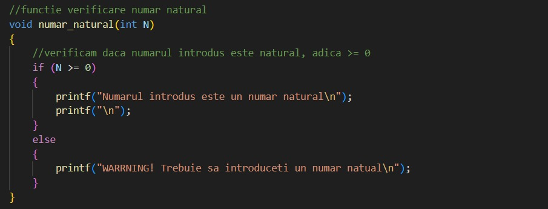
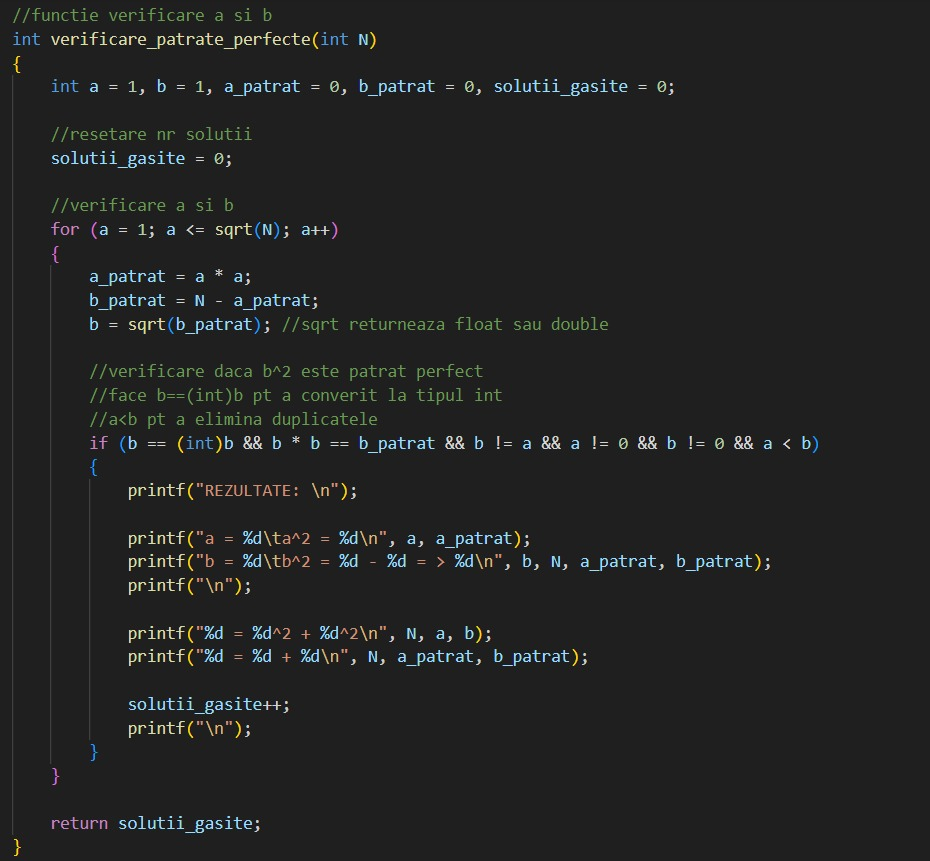

# **Proiect sincretic 2025**

*Proiect MAP*

Cerință: Se dă un număr natural N. Să se determine dacă acesta se poate descompune în sumă de două pătrate diferite
de zero.

Programul utilizează un meniu intercativ care permite:
* Introducerea unui număr natural <br>
* Determinarea soluțiilor posibile și afișează mesajul corespunător <br>
<br>

## Implementare

**Biblioteci utilizate:**

* *stdio.h* - pentru operații de intrare-ieșire <br>
* *stdlib.h* - pentru funcții auxiliare <br>
* *math.h* - pentru  operații matematice (ex. sqrt) <br>
<br>

**Funcții implemenate:**
* *numar_natural(int N)*
   - verifică dacă numărul introdus ese un număr natural (>0) <br> 
   
* *verificare_patrate_perfecte(int N)*
  - verifică toate perechile de valori (a) și (b) astfel încât (N=a^2+b^2) <br>
  - returnează numărul de soluții găsite și afișează detaliile perechilor găsite <br>
  
* *int main()*
  - gestionează meniul interactiv pentru utilizator și afișează detaliile perechilor găsite <br>
<br>

## Platforma software utilizată
**Sistem de operare:** `Windows 11` <br>
**Compilator:** `gcc`<br>
**Editor:** `Visual Studio Code`<br>
<br>

## Rezultate
Programul determină dacă un număr natural se poate descompune în sumă de 2 patrate diferite
<br>
<br>

## Modalitate de rulare
1. Deschideți un terminal (ex. WSL)
2. Navigați către directorul în care este salvat fișierul main.c, folosind comanda:
```bash
cd /cale/catre/proiect
```
3. Compilati codul folosind comanda:
```bash
gcc -Wall main.c -lm
```
4. Rulati programul folosind:
```bash
./a.out
```
<br>
<br>

#
*Student: Roșu Andreea-Florentina*

*Facultate: UPT*

*Specializare: Informatică*

*Anul: II*

*Data: Ianuarie 2025*
#
