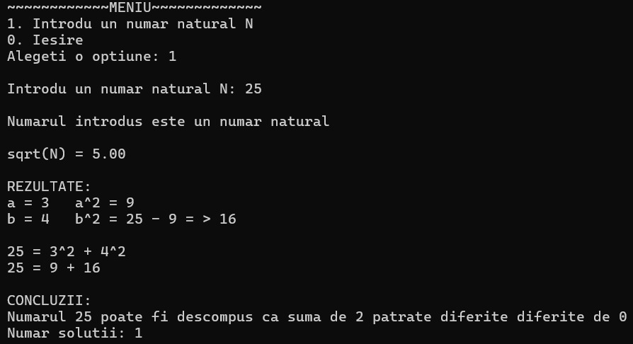

# **Proiect sincretic 2025**

*Proiect MAP*

Cerință: Se dă un număr natural N. Să se determine dacă acesta se poate descompune în sumă de două pătrate diferite
de zero.

Programul utilizează un meniu intercativ care permite:
* Introducerea unui număr natural <br>
* Determinarea soluțiilor posibile și afișează mesajul corespunător <br>
<br>

## Implementare

**Biblioteci utilizate:**

* *stdio.h* - pentru operații de intrare-ieșire <br>
* *stdlib.h* - pentru funcții auxiliare <br>
* *math.h* - pentru  operații matematice (ex. sqrt) <br>
  ```c
  #include<stdio.h>
  #include<stdlib.h>
  #include<math.h>
  ```
<br>

**Funcții implemenate:**
* *numar_natural(int N)*
   - verifică dacă numărul introdus este un număr natural (>0) <br> 
   ```c
   //functie verificare numar natural 
   void numar_natural(int N)
   {
    //verificam daca numarul introdus este natural, adica >= 0
    if (N >= 0)
    {
      printf("Numarul introdus este un numar natural\n");
      printf("\n");
    }
    else
    {
      printf("WARRNING! Trebuie sa introduceti un numar natual\n");
    }
  }
  ```
* *verificare_patrate_perfecte(int N)*
  - verifică toate perechile de valori (a) și (b) astfel încât (N=a^2+b^2) <br>
  - returnează numărul de soluții găsite și afișează detaliile perechilor găsite <br>
  ```c
  //functie verificare a si b
  int verificare_patrate_perfecte(int N)
  {
    int a = 1, b = 1, a_patrat = 0, b_patrat = 0, solutii_gasite = 0;
    //resetare nr solutii
    solutii_gasite = 0;
    
    //verificare a si b
    for (a = 1; a <= sqrt(N); a++)
    {
      a_patrat = a * a;
      b_patrat = N - a_patrat;
      b = sqrt(b_patrat); //sqrt returneaza float sau double

      //verificare daca b^2 este patrat perfect
      //face b==(int)b pt a converit la tipul int
      //a<b pt a elimina duplicatele
      if (b == (int)b && b * b == b_patrat && b != a && a != 0 && b != 0 && a < b)
      {
        printf("REZULTATE: \n");

        printf("a = %d\ta^2 = %d\n", a, a_patrat);
        printf("b = %d\tb^2 = %d - %d = > %d\n", b, N, a_patrat, b_patrat);
        printf("\n");

        printf("%d = %d^2 + %d^2\n", N, a, b);
        printf("%d = %d + %d\n", N, a_patrat, b_patrat);

        solutii_gasite++;
        printf("\n");
      }
    }

    return solutii_gasite;	
  }
  ```

* *int main()*
  - gestionează meniul interactiv pentru utilizator și afișează detaliile perechilor găsite <br>
  ```c
  int main()
  {
  int nr_natural_N, optiune, solutii_gasite = 0;

  while (1)
  {
    printf("~~~~~~~~~~~~MENIU~~~~~~~~~~~~~\n");
    printf("1. Introdu un numar natural N\n");
    printf("0. Iesire\n");
    printf("Alegeti o optiune: ");
    scanf("%d", &optiune);
    printf("\n");

    switch (optiune)
    {
      case 1:
      {
        printf("Introdu un numar natural N: ");
        scanf("%d", &nr_natural_N);
        printf("\n");

        //apelare functia care verifica numarul
        numar_natural(nr_natural_N);

        while (nr_natural_N < 0)
        {
          printf("Introduceti va rog un numar natural: ");
          scanf("%d", &nr_natural_N);
          printf("\n");
          if(nr_natural_N > 0)
          {
            printf("\n");
            printf("Felicitari, acuma ai introdus un numar natural\n");
            printf("\n");
          }
        }

        

        printf("sqrt(N) = %.2f\n", sqrt(nr_natural_N));
        printf("\n");

        //apel functia pt a ne returna nr de solutii
        solutii_gasite = verificare_patrate_perfecte(nr_natural_N);


        if (solutii_gasite == 0)
        {
          printf("CONCLUZII:\n");
          printf("Numarul %d nu poate fi descompuns ca suma de 2 patrate diferite de 0\n", nr_natural_N);
          printf("Numar solutii: %d\n", solutii_gasite);
          printf("\n");
          printf("\n");
        }

        else
        {
          printf("CONCLUZII:\n");
          printf("Numarul %d poate fi descompus ca suma de 2 patrate diferite de 0\n", nr_natural_N);
          printf("Numar solutii: %d\n", solutii_gasite);
          printf("\n");
          printf("\n");
        }
        break;
      }

      case 0:
      {
        printf("Programul s-a incheiat\n");
        exit(2);
        break;
      }
    }

  }
  return 0;
  }
  ```
  <br>

## Platforma software utilizată
**Sistem de operare:** `Windows 11` <br>
**Compilator:** `gcc`<br>
**Editor:** `Visual Studio Code`<br>
<br>

## Rezultate
Programul determină dacă un număr natural se poate descompune în sumă de 2 pătrate diferite
1. **Exemplu de rulare:**  
   - Utilizatorul a ales opțiunea `1` din meniu pentru a introduce un număr natural.  
   - A introdus numărul `25`.  
   - Programul a verificat dacă acest număr poate fi descompus în suma a două pătrate diferite de zero.  
   - Rezultatul a fost următorul: `25 = 3^2 + 4^2` (unde `3^2 = 9` și `4^2 = 16`).  
   - A fost găsită o soluție validă pentru această descompunere. <br>

    

2. Programul a verificat toate combinațiile posibile de valori pentru (a) și (b), astfel încât `N = a^2 + b^2`, cu condițiile:
   - a, b > 0
   - a ≠ b
   - a^2 + b^2 = N

Meniul interactiv permite utilizatorului să aleagă opțiunea de a introduce alte numere sau de a încheia programul.
<br>
<br>

## Modalitate de rulare
1. Deschideți un terminal (ex. WSL)
2. Navigați către directorul în care este salvat fișierul main.c, folosind comanda:
    ```bash
    cd /cale/catre/proiect
    ```
3. Compilati codul folosind comanda:
    ```bash
    gcc -Wall main.c -lm
    ```
4. Rulati programul folosind:
    ```bash
    ./a.out
    ```
<br>
<br>

#
*Student: Roșu Andreea-Florentina*

*Facultate: UPT*

*Specializare: Informatică*

*Anul: II*

*Data: Ianuarie 2025*
#
